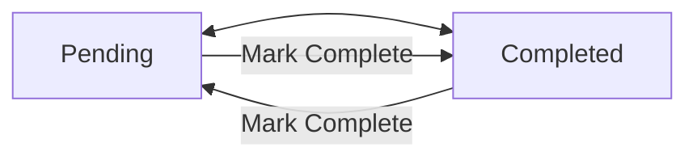

# Data Model: AI-Native Advanced Todo Console App

**Date**: 2026-01-05
**Feature**: 1-console-todo-cli
**Purpose**: Define core entities, fields, validation rules, and state transitions

## Entity: Task

### Description

Represents a todo item with all attributes required by the feature specification. Tasks are stored in-memory and identified by a unique numeric ID.

### Fields

| Field | Type | Required | Default | Constraints | Description |
|-------|------|----------|---------|-------------|-------------|
| `id` | `int` | Yes | Auto-increment | Positive integer, unique | Unique task identifier |
| `title` | `str` | Yes | None | Max 200 chars, non-empty | Task title/description |
| `description` | `str` | No | None | No limit | Optional additional details |
| `priority` | `Priority` | No | `Priority.MEDIUM` | Enum: HIGH/MEDIUM/LOW | Task importance level |
| `due_date` | `date` | No | None | Format YYYY-MM-DD, cannot be past | When task is due |
| `status` | `Status` | No | `Status.PENDING` | Enum: COMPLETED/PENDING | Completion state |
| `created_at` | `datetime` | Yes | Auto-generated | Cannot be modified | Creation timestamp |

### Enums

#### Priority

```python
class Priority(Enum):
    HIGH = "High"      # 🔴 Red
    MEDIUM = "Medium"  # 🟡 Yellow
    LOW = "Low"        # 🟢 Green
```

**Validation**:
- Must be one of High, Medium, Low (case-insensitive)
- Invalid values default to MEDIUM

#### Status

```python
class Status(Enum):
    PENDING = "pending"   # ⏳
    COMPLETED = "completed"  # ✅
```

**Validation**:
- Only two states: pending or completed
- Toggle between states (no other transitions)

### Validation Rules

1. **Title Validation** (FR-002, FR-023):
   - Required field
   - Non-empty string
   - Maximum 200 characters
   - Error: "Title is required" or "Title cannot exceed 200 characters"

2. **Priority Validation** (FR-003, FR-005):
   - Optional field
   - Valid values: "High", "Medium", "Low" (case-insensitive)
   - Default: "Medium"
   - Error: "Invalid priority. Must be High, Medium, or Low"

3. **Due Date Validation** (FR-004, FR-024):
   - Optional field
   - Format: YYYY-MM-DD
   - Must be today or future date
   - Error: "Invalid date format. Use YYYY-MM-DD" or "Due date cannot be in the past"

4. **Task ID Validation**:
   - Required for delete/update/complete operations
   - Must exist in task list
   - Error: "Task not found. Invalid task ID"

### State Transitions

#### Status Transitions



**Rules**:
- Toggle between Pending and Completed
- No intermediate states
- User triggers transition via "Mark Complete" command (feature 5)

#### Overdue Calculation

A task is overdue if:
- Status is `PENDING`
- Due date is set
- Due date < today's date

**Implementation**:
```python
def is_overdue(task: Task) -> bool:
    return (task.status == Status.PENDING and
            task.due_date is not None and
            task.due_date < date.today())
```

### Display Attributes

#### Priority Colors and Emojis

| Priority | Emoji | Color | Rich Style |
|----------|-------|-------|------------|
| HIGH | 🔴 | Red | `style="red"` |
| MEDIUM | 🟡 | Yellow | `style="yellow"` |
| LOW | 🟢 | Green | `style="green"` |

#### Status Emojis

| Status | Emoji | Condition |
|--------|-------|-----------|
| COMPLETED | ✅ | task.status == Status.COMPLETED |
| PENDING | ⏳ | task.status == Status.PENDING |
| OVERDUE | ⚠️ | task.status == Status.PENDING and task.due_date < today |

### Relationships

**No relationships in Phase 1**:
- Single-user application
- No subtasks or task dependencies
- No categories or tags (reserved for Phase 2+)

### Invariants

1. **Uniqueness**: Task IDs are unique and never reused
2. **Immutability**: `created_at` timestamp never changes
3. **Default Values**: Unspecified fields use defaults (priority=MEDIUM, status=PENDING)
4. **Date Consistency**: Due dates are validated against current date on create/update

### Storage Format

**Phase 1**: In-memory Python list
```python
tasks: list[Task] = []
```

**Phase 2+**: Planned extensions
- JSON file format: `[{id: 1, title: "...", ...}]`
- SQLite: `tasks` table with all fields
- PostgreSQL: Same schema as SQLite

### Example Task Instances

```python
# Task 1: Minimal (title only)
Task(
    id=1,
    title="Buy groceries",
    description=None,
    priority=Priority.MEDIUM,  # default
    due_date=None,
    status=Status.PENDING,  # default
    created_at=datetime(2026, 1, 5, 10, 30)
)

# Task 2: Complete with all fields
Task(
    id=2,
    title="Prepare hackathon demo",
    description="Create slides and practice presentation",
    priority=Priority.HIGH,
    due_date=date(2026, 1, 10),
    status=Status.PENDING,
    created_at=datetime(2026, 1, 5, 11, 0)
)

# Task 3: Overdue example
Task(
    id=3,
    title="Submit proposal",
    description=None,
    priority=Priority.HIGH,
    due_date=date(2026, 1, 1),  # Past date
    status=Status.PENDING,  # Still pending
    created_at=datetime(2026, 1, 3, 9, 0)
)
# is_overdue(task3) == True (pending + past due date)
```

### CRUD Operations

#### Create (Add Task)
```python
def add_task(tasks: list[Task], title: str, description: str | None = None,
             priority: Priority = Priority.MEDIUM, due_date: date | None = None) -> Task:
    """Create and add new task. Validates all inputs. Returns created task."""
    # Validation
    if not title or title.strip() == "":
        raise ValueError("Title is required")
    if len(title) > 200:
        raise ValueError("Title cannot exceed 200 characters")
    if due_date and due_date < date.today():
        raise ValueError("Due date cannot be in the past")

    # Create task
    new_id = len(tasks) + 1 if tasks else 1
    task = Task(
        id=new_id,
        title=title.strip(),
        description=description.strip() if description else None,
        priority=priority,
        due_date=due_date,
        status=Status.PENDING,
        created_at=datetime.now()
    )

    tasks.append(task)
    return task
```

#### Read (View/Search Tasks)
```python
def get_task(tasks: list[Task], task_id: int) -> Task | None:
    """Get task by ID. Returns None if not found."""
    for task in tasks:
        if task.id == task_id:
            return task
    return None

def search_tasks(tasks: list[Task], keyword: str | None = None,
                 priority: Priority | None = None,
                 status: Status | None = None) -> list[Task]:
    """Search tasks by keyword, priority, or status. Returns matching tasks."""
    results = tasks.copy()

    if keyword:
        results = [t for t in results
                   if keyword.lower() in t.title.lower() or
                   (t.description and keyword.lower() in t.description.lower())]

    if priority:
        results = [t for t in results if t.priority == priority]

    if status:
        results = [t for t in results if t.status == status]

    return results
```

#### Update (Modify Task)
```python
def update_task(tasks: list[Task], task_id: int, **kwargs) -> Task:
    """Update task attributes. Validates inputs. Returns updated task."""
    task = get_task(tasks, task_id)
    if not task:
        raise ValueError(f"Task {task_id} not found")

    # Validate and update each field
    if 'title' in kwargs:
        title = kwargs['title']
        if not title or title.strip() == "":
            raise ValueError("Title cannot be empty")
        if len(title) > 200:
            raise ValueError("Title cannot exceed 200 characters")
        task.title = title.strip()

    if 'description' in kwargs:
        task.description = kwargs['description'].strip() or None

    if 'priority' in kwargs:
        task.priority = kwargs['priority']

    if 'due_date' in kwargs:
        due_date = kwargs['due_date']
        if due_date and due_date < date.today():
            raise ValueError("Due date cannot be in the past")
        task.due_date = due_date

    return task
```

#### Delete (Remove Task)
```python
def delete_task(tasks: list[Task], task_id: int) -> Task:
    """Delete task by ID. Returns deleted task."""
    task = get_task(tasks, task_id)
    if not task:
        raise ValueError(f"Task {task_id} not found")

    tasks.remove(task)
    return task
```

#### Toggle Status (Mark Complete)
```python
def toggle_status(task: Task) -> Status:
    """Toggle task status between PENDING and COMPLETED."""
    if task.status == Status.PENDING:
        task.status = Status.COMPLETED
    else:
        task.status = Status.PENDING
    return task.status
```

### Sorting

```python
def sort_tasks(tasks: list[Task], by: str = "priority") -> list[Task]:
    """Sort tasks by priority, due date, or creation date."""
    priority_order = {Priority.HIGH: 0, Priority.MEDIUM: 1, Priority.LOW: 2}

    if by == "priority":
        return sorted(tasks, key=lambda t: (priority_order[t.priority], t.id))

    elif by == "due_date":
        return sorted(tasks,
                      key=lambda t: (t.due_date if t.due_date else date.max, t.id))

    elif by == "created_at":
        return sorted(tasks, key=lambda t: t.created_at, reverse=True)

    else:
        return tasks
```

### Statistics

```python
def get_summary(tasks: list[Task]) -> dict:
    """Calculate task summary statistics."""
    total = len(tasks)
    completed = sum(1 for t in tasks if t.status == Status.COMPLETED)
    pending = total - completed
    overdue = sum(1 for t in tasks if is_overdue(t))

    return {
        "total": total,
        "completed": completed,
        "pending": pending,
        "overdue": overdue
    }
```

---

## Future Extensions (Phase 2+)

### Potential Additional Fields

- `tags`: List[str] - Categories for organization
- `estimated_time`: timedelta - Time estimate
- `actual_time`: timedelta - Time spent
- `parent_id`: int | None - For subtasks
- `metadata`: dict - For AI agent integration

### Potential Relationships

- `Task.subtasks`: list[Task] - Nested tasks
- `Task.dependencies`: list[Task] - Task dependencies
- `Task.category`: Category - Category relationship

---

## References

- Feature Specification: `specs/1-console-todo-cli/spec.md`
- Functional Requirements: FR-001 through FR-025
- Constitution: `.specify/memory/constitution.md` - Principle III (Modular Design)
